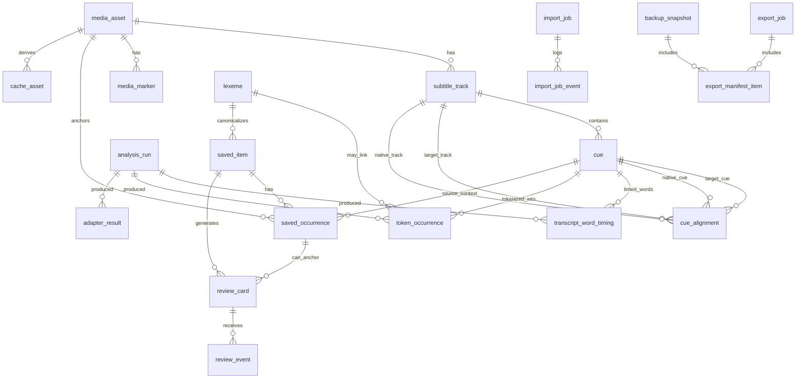

# Data Model and Storage

Status: split-out data model deliverable. Planning only.

## Typed model overview

## Data model summary

Use typed entities, not loose `map[string]any` blobs, except for explicitly versioned adapter payloads.

Minimum entities:

| Entity | Purpose | Key relationships |
|---|---|---|
| `MediaFile` | Local media reference, metadata, fingerprint. | Has subtitle tracks and progress. |
| `SubtitleTrack` | Target/native/other subtitle source. | Belongs to media; has cues. |
| `Cue` | Timed text interval. | Belongs to track; may align to native cue. |
| `TranscriptWordTiming` | Timed word/span from provider-native timing or forced alignment. | Belongs to cue/track/analysis run; may anchor saved occurrences. |
| `TokenOccurrence` | Token/span in a cue. | Belongs to cue; may have analysis. |
| `LanguageAnalysis` | Lemma/POS/morph/dictionary/translation payloads. | Versioned by adapter. |
| `SavedItem` | Learner-saved lexeme/phrase/sentence. | Points to one or more occurrences and source cue/time. |
| `SavedOccurrence` | Additional source contexts for a saved item. | Links item to cue/token/time. |
| `ReviewCard` | SRS card generated from saved item. | Has FSRS state/difficulty/stability/due fields. |
| `ReviewEvent` | Append-only review rating event. | Updates derived card scheduling state. |
| `PracticeAttempt` | Quiz/game attempt outcome. | Links mode, card/item, response, score. |
| `ProviderSetting` | Adapter enablement/consent. | Enforces local/default-off provider policy. |
| `ExportManifest` | Backup/Anki/export provenance. | Records fields/media included and warnings accepted. |

Core invariants:

1. A saved learning item must retain a source cue/time/media context, with word/span timing when available.
2. Review events are append-only; card state can be derived/audited from events and FSRS version.
3. Online provider outputs record provider/version/consent and are invalidatable.
4. Deleting/removing media must not silently destroy learner state; show broken-source state or require explicit cascade.
5. Backups/exports must state whether they include cue text, media snippets, notes, and review history.


## Domain identity layers

## Domain model overview

### Identity layers

| Layer | Identity principle | Mutability | Example |
|---|---|---:|---|
| `media_asset` | User-selected file plus content/stat fingerprint. | Path can change; content hash should not. | A local `.mkv` or `.mp4`. |
| `subtitle_track` | Media + language + role + source/version. | New version on reimport or regenerated transcript. | Polish target track, English native track. |
| `cue` | Track version + cue index/time/text hash. | Immutable within a track version. | Target cue 215, 00:12:03.100–00:12:06.400. |
| `transcript_word_timing` | Cue + track version + word/span index/time/provenance. | Recomputed or versioned with the transcript track. | Word 3 in cue 215, 00:12:03.620–00:12:03.910 from ElevenLabs or forced alignment. |
| `cue_alignment` | Pairing between cues with method/confidence. | Recomputed as alignment improves; versioned. | target cue 215 aligned to native cue 214. |
| `analysis_run` | Adapter + model/version + input scope. | Immutable result batch. | `spacy-pl@x.y`, `whisper.cpp@model`. |
| `token_occurrence` | Cue + analysis run + token span/index. | Recomputed when analysis changes. | Token 3 in cue 215, chars 11–16. |
| `lexeme` | Language + normalized lemma/surface + POS where available. | Mergeable with audit trail. | Polish lemma with UPOS `VERB`. |
| `saved_item` | Learner-owned concept: word, phrase, or sentence. | Editable note/meaning; not deleted silently. | Saved phrase “...” with learner meaning. |
| `saved_occurrence` | Exact source occurrence that was saved. | Immutable anchor; can be archived but not rewritten. | Token span in cue 215 with time range. |
| `review_card` | Practice prompt generated from saved item/occurrence. | Materialized schedule updates after events. | Recognition card due tomorrow. |
| `review_event` | Append-only rating/submission. | Immutable. | Good rating at timestamp. |


## Entity relationship diagram

### Entity relationship diagram




## SQLite schema recommendations

## Proposed SQLite schema

These schemas are intentionally typed. Flexible adapter payloads are allowed only behind `schema_version`, `adapter_id`, and `payload_kind` fields, and should be validated by adapter-specific codecs before use.

### Core media and import tables

| Table | Key columns | Purpose | Invariants |
|---|---|---|---|
| `media_asset` | `id`, `title`, `original_path`, `content_sha256`, `duration_ms`, `container`, `size_bytes`, `imported_at`, `last_seen_at`, `privacy_label` | One user-owned media object or app-managed copy. | If `content_sha256` is present, it must match the file at import time; `duration_ms > 0`; no remote protected URL as source. |
| `media_file_observation` | `id`, `media_id`, `path`, `size_bytes`, `mtime_ms`, `content_sha256`, `observed_at`, `exists` | Tracks moved/missing files without rewriting original import. | Append observations; do not silently delete learner state if media missing. |
| `import_job` | `id`, `status`, `source_kind`, `started_at`, `completed_at`, `error_code`, `input_manifest_json` | Auditable import pipeline run. | `input_manifest_json` validates against versioned schema; failures preserve events. |
| `import_job_event` | `id`, `job_id`, `level`, `message`, `created_at`, `data_json` | Debuggable import log. | No credentials or raw provider secrets in `data_json`. |
| `cache_asset` | `id`, `media_id`, `kind`, `path`, `content_sha256`, `derived_from`, `created_at`, `expires_at` | Generated clips, thumbnails, waveform/audio snippets, normalized subtitle copies. | Recomputable; safe to prune if not referenced by export snapshot. |
| `media_marker` | `id`, `media_id`, `kind`, `time_ms`, `cue_id`, `label`, `created_at` | Progress/vocab/checkpoint markers on timeline. | Markers reference local learner or derived state only. |

### Subtitle, cue, alignment, and transcript indexing tables

| Table | Key columns | Purpose | Invariants |
|---|---|---|---|
| `subtitle_track` | `id`, `media_id`, `language`, `role`, `format`, `source_kind`, `source_path`, `content_sha256`, `track_version`, `is_active`, `created_at` | Target/native/other subtitle or transcript track. | Unique active track per `(media_id, role, language)` unless explicitly allowed; new `track_version` on content change. |
| `cue` | `id`, `track_id`, `cue_index`, `start_ms`, `end_ms`, `text`, `normalized_text`, `text_sha256`, `created_at` | Normalized subtitle/transcript cue. | `start_ms < end_ms`; unique `(track_id, cue_index)`; cue text sanitized before display. |
| `cue_text_span` | `id`, `cue_id`, `span_kind`, `char_start`, `char_end`, `text` | Phrase/sentence/subspan anchors inside cue text. | Span bounds within cue text; used for phrase/sentence saves. |
| `transcript_word_timing` | `id`, `track_id`, `cue_id`, `analysis_run_id`, `word_index`, `char_start`, `char_end`, `text`, `normalized_text`, `start_ms`, `end_ms`, `confidence`, `speaker_id`, `source_kind`, `engine`, `model_version`, `created_at` | First-class provider-native or forced-aligned word/span timing. | `start_ms < end_ms`; timing belongs to the cue range with tolerance; source kind is typed (`provider-word-timing`, `forced-alignment`, `manual-edit`); do not bury word timings only in `adapter_result.payload_json`. |
| `cue_alignment` | `id`, `media_id`, `target_track_id`, `native_track_id`, `target_cue_id`, `native_cue_id`, `method`, `confidence`, `alignment_version`, `created_at` | Target/native cue pairing. | Paired cues belong to same media; confidence in `[0,1]`; method is enum, e.g. `timestamp`, `text_similarity`, `manual`. |
| `transcript_index` | `id`, `media_id`, `track_id`, `cue_id`, `search_text`, `language`, `fts_version` | FTS/search projection for transcript. | Rebuildable from cue text; not learner-owned. |

Recommended indexes:

```sql
CREATE INDEX idx_cue_track_time ON cue(track_id, start_ms, end_ms);
CREATE INDEX idx_cue_media_time ON subtitle_track(media_id, role, language);
CREATE INDEX idx_word_timing_cue_time ON transcript_word_timing(cue_id, start_ms, end_ms);
CREATE INDEX idx_alignment_target ON cue_alignment(target_cue_id, native_cue_id);
CREATE VIRTUAL TABLE transcript_fts USING fts5(search_text, cue_id UNINDEXED, media_id UNINDEXED, language UNINDEXED);
```

### Language analysis and token identity tables

| Table | Key columns | Purpose | Invariants |
|---|---|---|---|
| `adapter` | `id`, `kind`, `name`, `version`, `execution_mode`, `privacy_class`, `enabled` | Registered adapter implementation. | Online adapters default disabled; `privacy_class` is explicit. |
| `analysis_run` | `id`, `adapter_id`, `input_scope_kind`, `input_scope_id`, `model_name`, `model_version`, `schema_version`, `started_at`, `completed_at`, `status` | Immutable batch of analysis results. | Every produced token/result points back to a run. |
| `token_occurrence` | `id`, `cue_id`, `analysis_run_id`, `token_index`, `char_start`, `char_end`, `surface`, `normalized`, `lemma`, `upos`, `xpos`, `confidence` | Concrete token in a cue. | Token char span within cue; `(cue_id, analysis_run_id, token_index)` unique. |
| `token_morph_feature` | `id`, `token_occurrence_id`, `feature_key`, `feature_value` | Typed morphology key/value features. | Avoid untyped morph blobs in core UI logic. |
| `lexeme` | `id`, `language`, `normalized`, `lemma`, `upos`, `canonical_display`, `created_at`, `merge_parent_id` | Cross-occurrence lexical identity. | Merge by explicit operation; preserve old IDs by `merge_parent_id`. |
| `token_lexeme_link` | `id`, `token_occurrence_id`, `lexeme_id`, `link_kind`, `confidence` | Links an occurrence to a lexeme. | Multiple candidates allowed only when confidence is represented. |
| `adapter_result` | `id`, `analysis_run_id`, `payload_kind`, `scope_kind`, `scope_id`, `schema_version`, `payload_json`, `confidence`, `created_at` | Versioned flexible results: dictionary entry, translation, grammar explanation, ASR segment/quality report. | `payload_json` validated by `payload_kind` + `schema_version`; no silent online result if adapter disabled; word timings that drive UI/saved anchors should be normalized into `transcript_word_timing`. |

**REC-6:** Use a deterministic **semantic key** only as a deduplication aid, not as the primary key. Primary IDs can be UUID/ULID, while unique constraints prevent duplicates. Example token semantic key:

```text
token_key = sha256(
  cue_id + analysis_run_id + token_index + char_start + char_end + normalized_surface
)
```

The `analysis_run_id` belongs in the key because tokenizer/model changes can legitimately produce different token boundaries for the same cue text.

### Saved occurrence and learner state tables

| Table | Key columns | Purpose | Invariants |
|---|---|---|---|
| `saved_item` | `id`, `kind`, `language`, `display_text`, `canonical_lexeme_id`, `meaning`, `notes`, `created_at`, `updated_at`, `archived_at` | Learner-owned word/phrase/sentence concept. | `kind in ('lexeme','phrase','sentence')`; archiving does not delete occurrences/events. |
| `saved_occurrence` | `id`, `saved_item_id`, `media_id`, `cue_id`, `start_ms`, `end_ms`, `selection_kind`, `selection_text`, `context_before`, `context_after`, `created_at` | Exact media/cue/time context that was saved. | Immutable anchor; if source cue is reprocessed, occurrence retains original cue and can be migrated with audit. |
| `saved_occurrence_token` | `id`, `saved_occurrence_id`, `token_occurrence_id`, `ordinal` | Token span membership for saved word/phrase. | Tokens must belong to the saved occurrence's cue unless selection crosses cues explicitly. |
| `saved_occurrence_word_timing` | `id`, `saved_occurrence_id`, `word_timing_id`, `ordinal` | Optional exact spoken word/span timing anchor for saved word/phrase. | Word timings must belong to the saved occurrence's cue/track version; if transcript is superseded, keep old timing and offer re-anchor rather than rewriting. |
| `saved_item_relation` | `id`, `source_item_id`, `target_item_id`, `relation_kind`, `created_at` | Links phrase/sentence/lexeme variants. | Relation kinds typed: `contains`, `variant_of`, `same_lemma`, `user_linked`. |
| `learner_note` | `id`, `scope_kind`, `scope_id`, `note_text`, `created_at`, `updated_at` | Notes attached to media/cue/token/saved item/card. | Scope must resolve to local object; no remote account dependencies. |

**REC-7:** Never treat a saved vocabulary row as detached from context. The review UI can show a summarized `saved_item`, but every card should pick a `saved_occurrence` so the learner can return to the exact video segment.

### Review and FSRS tables

| Table | Key columns | Purpose | Invariants |
|---|---|---|---|
| `review_card` | `id`, `saved_item_id`, `saved_occurrence_id`, `card_type`, `prompt_template`, `created_at`, `suspended_at`, `deleted_at` | Durable card identity. | Card can be suspended; do not hard-delete events. |
| `review_card_state` | `card_id`, `state`, `due_at`, `stability`, `difficulty`, `elapsed_days`, `scheduled_days`, `reps`, `lapses`, `last_reviewed_at`, `fsrs_version`, `updated_at` | Materialized current scheduling state. | Derived from initial state plus review events; can be recomputed. |
| `review_event` | `id`, `card_id`, `reviewed_at`, `rating`, `response_ms`, `previous_state_json`, `next_state_json`, `device_id`, `created_at` | Append-only review log. | Ratings typed: `again`, `hard`, `good`, `easy`; no event rewrite except explicit repair migration. |
| `practice_session` | `id`, `mode`, `started_at`, `completed_at`, `filter_json`, `summary_json` | Session-level grouping for games/reviews. | Does not own card truth; references events. |
| `practice_attempt` | `id`, `session_id`, `card_id`, `mode`, `prompt_json`, `answer_json`, `correctness`, `created_at` | Non-FSRS attempts for quiz/game analytics. | FSRS-changing attempts must also create `review_event` or explicitly not affect scheduling. |

**REC-8:** Keep `review_card_state` as a materialized projection and `review_event` as the audit source. This preserves learner history across FSRS library upgrades and enables repair/replay if a scheduler bug is found.

### Settings, privacy, import/export, and backup tables

| Table | Key columns | Purpose | Invariants |
|---|---|---|---|
| `app_setting` | `key`, `value_json`, `schema_version`, `updated_at` | Local settings. | Online/provider settings must include explicit enabled flag and data classes. |
| `provider_policy` | `id`, `adapter_id`, `enabled`, `allowed_data_classes`, `requires_confirmation`, `created_at`, `updated_at` | Opt-in provider gate. | Online adapters disabled by default; tests enforce no-call when disabled. |
| `export_job` | `id`, `kind`, `status`, `started_at`, `completed_at`, `path`, `manifest_sha256`, `error_code` | Anki/JSON/backup export run. | Export manifests include schema version and privacy label. |
| `export_manifest_item` | `id`, `export_job_id`, `item_kind`, `item_id`, `path`, `sha256`, `included` | Exact exported objects/files. | Manifest readback can verify export completeness. |
| `backup_snapshot` | `id`, `kind`, `created_at`, `db_sha256`, `manifest_path`, `media_policy`, `notes` | User-created backup. | Media may be referenced or copied; policy explicit. |
| `schema_migration` | `version`, `name`, `applied_at`, `checksum`, `result` | Migration ledger. | Forward-only migrations; checksums protect drift. |


## Migration/versioning plan

- Use forward-only migrations with a `schema_migration` ledger containing version, name, checksum, applied timestamp, and result.
- Treat subtitle track changes, generated transcript regeneration, tokenizer/model upgrades, and adapter schema changes as versioned data changes, not in-place rewrites.
- Store parser/adapter/model versions and payload schema versions beside derived data.
- Provide migration helpers such as `cue_version_link` and saved-occurrence relinking with confidence, but never silently retarget learner history.

## Append-only learner-state/audit strategy

- `review_event` is append-only; `review_card_state` is materialized and recomputable.
- `saved_occurrence` anchors are immutable; archive/suspend rather than silent hard-delete.
- Important import/export/provider operations record jobs/events/manifests without secrets or raw provider payload logs.
- Deletions that destroy learner state require explicit user confirmation and should preserve a local audit record unless hard-delete is requested.

## Import/export strategy

- Import local media paths and subtitle files with source provenance, hashes/fingerprints when feasible, parser version, and privacy label.
- Export local JSON/SQLite/Anki packages through an `export_job` and `export_manifest_item` manifest listing included text/media/review data and checksums.
- Default backups are metadata-only; generated clips/media copies are opt-in.
- Anki export is local/export-only by default; AnkiConnect or sync is a separate mutation/privacy gate.
