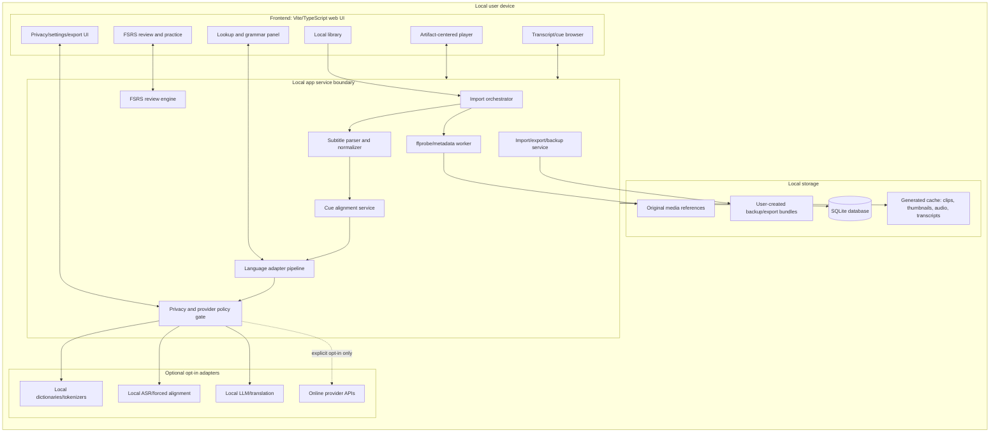

# Local-First Architecture

Status: split-out architecture deliverable derived from the final planning bundle. Planning only.

## Recommended app shell: web / Tauri / local-server tradeoff

### Recommended app shell tradeoff

| Option | Fit | Pros | Risks | Recommendation |
|---|---:|---|---|---|
| Browser-only local web app | High for MVP-0 | Fast iteration, easiest frontend/test setup, no desktop packaging. | File access is constrained; local service still needed for ffmpeg/SQLite unless using browser storage. | Use for first spikes. |
| Local web app + local service | Very high | Strong SQLite/filesystem/ffmpeg/ASR support; keeps UI flexible. | Need local process lifecycle and localhost security. | Primary architecture. |
| Tauri desktop shell | High for V1 | Better file dialogs, packaging, local filesystem affordances. | Adds packaging/build complexity. | Keep compatible; do not require initially. |
| Existing player integration (`mpv`, `asbplayer`) | Medium/high depending substrate | Can reduce player complexity. | May fight artifact-centered saved occurrence/review model. | Spike as substrate/reference before custom player commitment. |
| Full custom media engine | Medium | Maximum control. | High complexity and browser media edge cases. | Avoid until substrate spike proves necessary. |


## Component diagram

## Architecture overview

### System shape




## Data flow

## Data lifecycle

```mermaid
sequenceDiagram
  participant User
  participant UI as Frontend UI
  participant Svc as Local service
  participant DB as SQLite
  participant FS as Filesystem/cache
  participant Adapter as Local/opt-in adapters

  User->>UI: Select local video + subtitle tracks
  UI->>Svc: create import request
  Svc->>FS: read metadata, optional normalized copies
  Svc->>DB: insert media_asset, subtitle_track, import_job
  Svc->>Svc: parse cues, normalize times/text
  Svc->>DB: insert cue rows and track version
  Svc->>Svc: align target/native cues
  Svc->>DB: insert cue_alignment rows
  Svc->>Adapter: run tokenizer/POS/dictionary if enabled
  Adapter-->>Svc: typed analysis results with adapter metadata
  Svc->>DB: insert analysis_run, token_occurrence, adapter_result
  User->>UI: watch, click token/phrase, save occurrence
  UI->>Svc: create saved item + occurrence
  Svc->>DB: append learner-owned saved_item/saved_occurrence
  Svc->>DB: create review_card(s)
  User->>UI: review card
  UI->>Svc: submit rating
  Svc->>DB: append review_event; update materialized card state
```


## Service boundaries

### Storage and trust boundaries

| Boundary | Owns | Must not own | Notes |
|---|---|---|---|
| Frontend UI | Rendering state, selected media/cue/part, local form state, transient playback state. | Secrets, authoritative review scheduling state, raw provider credentials. | UI can cache ephemeral state but persists through service APIs. |
| Local service | Domain invariants, import pipeline, analysis orchestration, review engine, export/backup. | Proprietary remote media/API data; ambient online calls. | Enforces privacy/provider policy gate. |
| SQLite | Metadata, cue/token indexes, saved occurrences, review state/events, settings, adapter result metadata. | Large media blobs by default; provider secrets; unbounded generated clips. | WAL mode plus backup discipline recommended. |
| Filesystem media root | Original local media references and optional app-managed copies if user chooses. | Remote/protected downloads. | Prefer references first; copy/import only with explicit user action. |
| Filesystem cache root | Generated thumbnails, cue audio, clips, ASR transcripts, normalized subtitle copies. | Irreplaceable learner state. | Recomputable; can be pruned by policy. |
| Backup/export root | Portable JSON/SQLite/Anki/export bundles and manifests. | Hidden credentials; unredacted provider logs. | Should include manifest, schema version, hashes, and privacy label. |
| Optional provider boundary | Adapter inputs/outputs when enabled. | Silent network calls; broad media upload by default. | Policy gate records provider, scope, consent, and data classes. |


## Local/offline privacy model

## Data classes and privacy posture

| Data class | Examples | Default storage | External sharing default | Special notes |
|---|---|---|---|---|
| Media file references | `/path/video.mkv`, hash, duration | SQLite + local path reference | Never | Do not copy media into backups unless enabled. |
| Subtitle/cue text | target/native cues, generated transcripts, provider captions, corrected tracks | SQLite/local cache | Never | May contain copyrighted/private text; provider/ASR captions are draft until corrected/approved; redact from logs by default. |
| Token/language analysis | tokens, lemma, POS, morphology | Recomputable local tables | Never unless adapter opted in | Adapter payloads must be versioned. |
| Saved learning objects | saved word/phrase/sentence plus cue/time/media context | Local learner-state tables | Never | Occurrence-first; preserve source context. |
| Review history | FSRS state, ratings, due dates, lapses | Local append-only review events | Never | Sensitive learning profile. |
| Notes/meanings | learner notes, translations, examples | Local | Never | Online translation/LLM use needs explicit consent. |
| Audio/voice recordings | shadowing/pronunciation clips | Local temp or opted-in cache | Never by default | Treat as high sensitivity; delete temp recordings unless saved intentionally. |
| Diagnostics/logs | errors, adapter status, ids | Local logs | Never by default | Avoid raw cue text, media paths, notes, provider payloads unless verbose local debug is enabled. |
| Backups/exports | DB backups, `.apkg`, JSON export | User-chosen local path | Never by default | Include warnings about media/text exposure and sync destinations. |


## Media/cache strategy

- Store original media as references by default; app-managed copy only by explicit user action.
- Store generated thumbnails/audio/clips/transcripts in a pruneable cache, not as authoritative learner state.
- Keep subtitle/cue text in SQLite with provenance; treat it as private/copyright-sensitive data.
- Back up metadata first; copied media and clips require explicit opt-in.

## Failure modes

- Missing/moved media: preserve learner state and offer relink.
- Malformed subtitles: fail import without corrupting existing tracks.
- Adapter failure: preserve raw cue/token state and show unavailable/low-confidence result.
- Provider disabled/offline: zero network calls and graceful disabled state.
- Cache prune/miss: regenerate derived clips/assets; never lose review events or saved occurrences.
- Track reimport/regeneration: create new track/cue versions and preserve old saved occurrence anchors.
