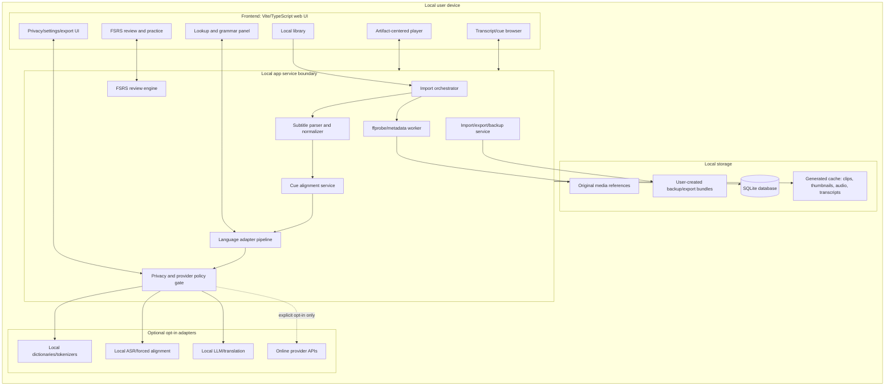
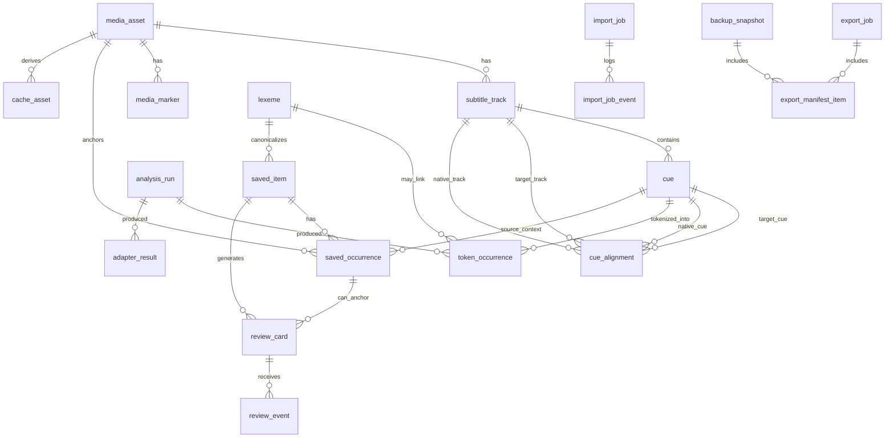
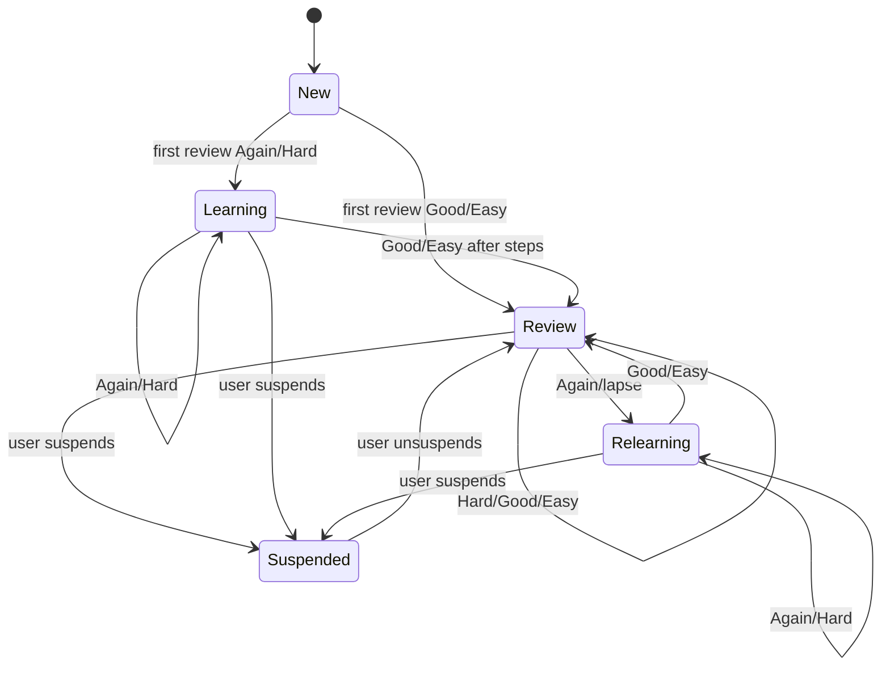

# Local-First Architecture, Data Model, and Test Plan — Lingotorte

**Task:** `t_a6fb090d`  
**Workspace:** `/home/openclaw/workspace/lingotorte`  
**Artifact path:** `/home/openclaw/workspace/lingotorte/docs/planning/local-first-architecture-data-model.md`  
**Status:** implementation-ready planning document; no app implementation  
**Hard boundary:** local/offline default; online providers are opt-in only; no credentials, deployments, service restarts, account mutation, DRM circumvention, or external side effects.

## Artifact Navigation

Role: analysis  
Review scope: analysis_traceability

Derived from:
- /home/openclaw/workspace/lingotorte/AGENTS.md
  -> project operating boundaries, local/private product framing, artifact-centered design principle, and recommended read order.
- /home/openclaw/workspace/lingotorte/README.md
  -> workspace purpose, source provenance, screenshot evidence pointers, and boundary reminder.
- /home/openclaw/workspace/lingotorte/docs/mission/hermes-war-room-mission-statement.md
  -> required final deliverable expectations, local/offline defaults, lane structure, and quality bar.
- /home/openclaw/workspace/lingotorte/docs/mission/lingopie-war-room-brief.md
  -> lane-level scope, quality gates, initial hypothesis, and local-first product architecture lane target.
- /home/openclaw/workspace/lingotorte/docs/research/preliminary-grounding-research.md
  -> preliminary architecture sketch, data model seed, OSS substrate seeds, MVP cut, and open questions.
- /home/openclaw/workspace/lingotorte/docs/research/live-ui-inventory.md
  -> sanitized observed UI mechanics: catalog, player, transcript, vocabulary, practice, SRS states, and privacy caveats.

Feeds:
- /home/openclaw/workspace/lingotorte/docs/architecture/local-first-architecture.md
  -> can be split into a dedicated architecture artifact later.
- /home/openclaw/workspace/lingotorte/docs/architecture/data-model-and-storage.md
  -> can be split into a dedicated data model/storage artifact later.
- /home/openclaw/workspace/lingotorte/docs/architecture/language-adapter-design.md
  -> can be split into adapter-specific design later.
- /home/openclaw/workspace/lingotorte/docs/plan/mvp-spike-plan.md
  -> can reuse the feature-by-feature test strategy and spikes.

## Evidence labels used in this document

| Label | Evidence type | Source | Confidence | How it is used here |
|---|---|---|---:|---|
| E-CTX | Project context | `AGENTS.md`, `README.md` | High | Defines non-negotiable boundaries: owned/local media, privacy default, no proprietary copying, evidence labels, artifact-centered design. |
| E-MISSION | Mission specification | `docs/mission/hermes-war-room-mission-statement.md`, `docs/mission/lingopie-war-room-brief.md` | High | Defines required deliverable shape, local-first/default choices, suggested lanes, and quality bar. |
| E-RESEARCH | Preliminary research synthesis | `docs/research/preliminary-grounding-research.md` | Medium-high | Seeds product decomposition, architecture, typed model, MVP slices, and OSS candidates. |
| E-LIVE | Sanitized live UI observation | `docs/research/live-ui-inventory.md` | Medium | Grounds user-visible mechanics without copying private content, proprietary data, or account state. |
| REC | Recommendation | This document | Varies | Proposed design choice derived from evidence plus local-first constraints. |
| OPEN | Open question | This document | N/A | A decision or risk that should be resolved by a later spike or Janusz decision. |

## Executive recommendation

**REC-1:** Build Lingotorte as a local-first, artifact-centered media-learning app whose source of truth is local SQLite plus a filesystem media/cache root. The central domain object is not a catalog item or dictionary entry; it is a **media time range with aligned subtitle/transcript cues**. Vocabulary, sentence mining, grammar analysis, progress, and review should all anchor back to that artifact.

**REC-2:** Use a local web app architecture with a Tauri-compatible path, but do not require Tauri for MVP-0. The first implementation can be a TypeScript/Vite frontend talking to a local service boundary. The service can be TypeScript-first for product state and Python/`uv`-based for optional ASR/NLP workers where that ecosystem materially helps.

**REC-3:** Separate three classes of data from day one:

1. **Source-derived/recomputable state** — parsed cues, tokenization, alignments, generated thumbnails/audio, adapter results. These can be invalidated and recomputed when parsers/adapters change.
2. **Learner-owned state** — saved occurrences, notes, review cards, review events, settings. This must be durable, append-friendly, backed up, and never silently overwritten by re-analysis.
3. **Provider/cache state** — local dictionary caches, optional LLM/translation/ASR results, export manifests. This must carry provider, model, version, privacy, and reproducibility metadata.

**REC-4:** Treat online translation/dictionary/ASR/LLM providers as explicit opt-in adapter implementations, not as ambient dependencies. Local/offline adapters are defaults; online adapters must have per-feature consent, visible data sharing scope, and tests proving that disabled providers do not make network calls.

**REC-5:** Model saved words/phrases/sentences as **saved occurrences**, not merely vocabulary rows. A saved item may aggregate multiple occurrences, but every card and practice prompt should be able to show the exact media, cue, token span, timestamp, and surrounding context that caused the learner to save it.

## Non-goals and safety constraints

| Type | Constraint | Rationale / source |
|---|---|---|
| Non-goal | Do not clone Lingopie proprietary service, catalog, source code, private APIs, media, subtitle files, branding, or account data. | E-CTX, E-MISSION |
| Non-goal | Do not bypass DRM, capture protected streams, scrape protected media, or download proprietary content. | E-CTX, E-MISSION |
| Non-goal | Do not implement live Lingopie account integration, profile sync, word saves, review submissions, or pronunciation submissions. | E-CTX, E-MISSION, E-LIVE |
| Non-goal | Do not require online translation/LLM/ASR providers for MVP. | E-CTX, E-MISSION, E-RESEARCH |
| Non-goal | Do not require a streaming catalog for MVP; local library is enough. | E-LIVE local-product implications |
| Safety | Store user media paths, subtitles, saved vocabulary, notes, reviews, and progress locally by default. | E-CTX privacy-by-default boundary |
| Safety | Treat subtitles/transcripts as untrusted input; sanitize HTML/ASS markup before rendering. | REC threat-model inference |
| Safety | Keep credentials out of the app in MVP. If online providers are later enabled, use explicit local secret storage and never commit/provider-log secrets. | E-MISSION, REC |
| Safety | Preserve evidence labels in downstream documents and UI references: observed live UI vs public docs vs recommendation/inference. | E-CTX, E-MISSION |

## Architecture overview

### System shape



### Storage and trust boundaries

| Boundary | Owns | Must not own | Notes |
|---|---|---|---|
| Frontend UI | Rendering state, selected media/cue/part, local form state, transient playback state. | Secrets, authoritative review scheduling state, raw provider credentials. | UI can cache ephemeral state but persists through service APIs. |
| Local service | Domain invariants, import pipeline, analysis orchestration, review engine, export/backup. | Proprietary remote media/API data; ambient online calls. | Enforces privacy/provider policy gate. |
| SQLite | Metadata, cue/token indexes, saved occurrences, review state/events, settings, adapter result metadata. | Large media blobs by default; provider secrets; unbounded generated clips. | WAL mode plus backup discipline recommended. |
| Filesystem media root | Original local media references and optional app-managed copies if user chooses. | Remote/protected downloads. | Prefer references first; copy/import only with explicit user action. |
| Filesystem cache root | Generated thumbnails, cue audio, clips, ASR transcripts, normalized subtitle copies. | Irreplaceable learner state. | Recomputable; can be pruned by policy. |
| Backup/export root | Portable JSON/SQLite/Anki/export bundles and manifests. | Hidden credentials; unredacted provider logs. | Should include manifest, schema version, hashes, and privacy label. |
| Optional provider boundary | Adapter inputs/outputs when enabled. | Silent network calls; broad media upload by default. | Policy gate records provider, scope, consent, and data classes. |

### Recommended app shell tradeoff

| Option | Fit | Pros | Risks | Recommendation |
|---|---:|---|---|---|
| Browser-only local web app | High for MVP-0 | Fast iteration, easiest frontend/test setup, no desktop packaging. | File access is constrained; local service still needed for ffmpeg/SQLite unless using browser storage. | Use for first spikes. |
| Local web app + local service | Very high | Strong SQLite/filesystem/ffmpeg/ASR support; keeps UI flexible. | Need local process lifecycle and localhost security. | Primary architecture. |
| Tauri desktop shell | High for V1 | Better file dialogs, packaging, local filesystem affordances. | Adds packaging/build complexity. | Keep compatible; do not require initially. |
| Existing player integration (`mpv`, `asbplayer`) | Medium/high depending substrate | Can reduce player complexity. | May fight artifact-centered saved occurrence/review model. | Spike as substrate/reference before custom player commitment. |
| Full custom media engine | Medium | Maximum control. | High complexity and browser media edge cases. | Avoid until substrate spike proves necessary. |

## Data lifecycle

```mermaid
sequenceDiagram
  participant User
  participant UI as Frontend UI
  participant Svc as Local service
  participant DB as SQLite
  participant FS as Filesystem/cache
  participant Adapter as Local/opt-in adapters

  User->>UI: Select local video + subtitle tracks
  UI->>Svc: create import request
  Svc->>FS: read metadata, optional normalized copies
  Svc->>DB: insert media_asset, subtitle_track, import_job
  Svc->>Svc: parse cues, normalize times/text
  Svc->>DB: insert cue rows and track version
  Svc->>Svc: align target/native cues
  Svc->>DB: insert cue_alignment rows
  Svc->>Adapter: run tokenizer/POS/dictionary if enabled
  Adapter-->>Svc: typed analysis results with adapter metadata
  Svc->>DB: insert analysis_run, token_occurrence, adapter_result
  User->>UI: watch, click token/phrase, save occurrence
  UI->>Svc: create saved item + occurrence
  Svc->>DB: append learner-owned saved_item/saved_occurrence
  Svc->>DB: create review_card(s)
  User->>UI: review card
  UI->>Svc: submit rating
  Svc->>DB: append review_event; update materialized card state
```

## Domain model overview

### Identity layers

| Layer | Identity principle | Mutability | Example |
|---|---|---:|---|
| `media_asset` | User-selected file plus content/stat fingerprint. | Path can change; content hash should not. | A local `.mkv` or `.mp4`. |
| `subtitle_track` | Media + language + role + source/version. | New version on reimport or regenerated transcript. | Polish target track, English native track. |
| `cue` | Track version + cue index/time/text hash. | Immutable within a track version. | Target cue 215, 00:12:03.100–00:12:06.400. |
| `cue_alignment` | Pairing between cues with method/confidence. | Recomputed as alignment improves; versioned. | target cue 215 aligned to native cue 214. |
| `analysis_run` | Adapter + model/version + input scope. | Immutable result batch. | `spacy-pl@x.y`, `whisper.cpp@model`. |
| `token_occurrence` | Cue + analysis run + token span/index. | Recomputed when analysis changes. | Token 3 in cue 215, chars 11–16. |
| `lexeme` | Language + normalized lemma/surface + POS where available. | Mergeable with audit trail. | Polish lemma with UPOS `VERB`. |
| `saved_item` | Learner-owned concept: word, phrase, or sentence. | Editable note/meaning; not deleted silently. | Saved phrase “...” with learner meaning. |
| `saved_occurrence` | Exact source occurrence that was saved. | Immutable anchor; can be archived but not rewritten. | Token span in cue 215 with time range. |
| `review_card` | Practice prompt generated from saved item/occurrence. | Materialized schedule updates after events. | Recognition card due tomorrow. |
| `review_event` | Append-only rating/submission. | Immutable. | Good rating at timestamp. |

### Entity relationship diagram



## Proposed SQLite schema

These schemas are intentionally typed. Flexible adapter payloads are allowed only behind `schema_version`, `adapter_id`, and `payload_kind` fields, and should be validated by adapter-specific codecs before use.

### Core media and import tables

| Table | Key columns | Purpose | Invariants |
|---|---|---|---|
| `media_asset` | `id`, `title`, `original_path`, `content_sha256`, `duration_ms`, `container`, `size_bytes`, `imported_at`, `last_seen_at`, `privacy_label` | One user-owned media object or app-managed copy. | If `content_sha256` is present, it must match the file at import time; `duration_ms > 0`; no remote protected URL as source. |
| `media_file_observation` | `id`, `media_id`, `path`, `size_bytes`, `mtime_ms`, `content_sha256`, `observed_at`, `exists` | Tracks moved/missing files without rewriting original import. | Append observations; do not silently delete learner state if media missing. |
| `import_job` | `id`, `status`, `source_kind`, `started_at`, `completed_at`, `error_code`, `input_manifest_json` | Auditable import pipeline run. | `input_manifest_json` validates against versioned schema; failures preserve events. |
| `import_job_event` | `id`, `job_id`, `level`, `message`, `created_at`, `data_json` | Debuggable import log. | No credentials or raw provider secrets in `data_json`. |
| `cache_asset` | `id`, `media_id`, `kind`, `path`, `content_sha256`, `derived_from`, `created_at`, `expires_at` | Generated clips, thumbnails, waveform/audio snippets, normalized subtitle copies. | Recomputable; safe to prune if not referenced by export snapshot. |
| `media_marker` | `id`, `media_id`, `kind`, `time_ms`, `cue_id`, `label`, `created_at` | Progress/vocab/checkpoint markers on timeline. | Markers reference local learner or derived state only. |

### Subtitle, cue, alignment, and transcript indexing tables

| Table | Key columns | Purpose | Invariants |
|---|---|---|---|
| `subtitle_track` | `id`, `media_id`, `language`, `role`, `format`, `source_kind`, `source_path`, `content_sha256`, `track_version`, `is_active`, `created_at` | Target/native/other subtitle or transcript track. | Unique active track per `(media_id, role, language)` unless explicitly allowed; new `track_version` on content change. |
| `cue` | `id`, `track_id`, `cue_index`, `start_ms`, `end_ms`, `text`, `normalized_text`, `text_sha256`, `created_at` | Normalized subtitle/transcript cue. | `start_ms < end_ms`; unique `(track_id, cue_index)`; cue text sanitized before display. |
| `cue_text_span` | `id`, `cue_id`, `span_kind`, `char_start`, `char_end`, `text` | Phrase/sentence/subspan anchors inside cue text. | Span bounds within cue text; used for phrase/sentence saves. |
| `cue_alignment` | `id`, `media_id`, `target_track_id`, `native_track_id`, `target_cue_id`, `native_cue_id`, `method`, `confidence`, `alignment_version`, `created_at` | Target/native cue pairing. | Paired cues belong to same media; confidence in `[0,1]`; method is enum, e.g. `timestamp`, `text_similarity`, `manual`. |
| `transcript_index` | `id`, `media_id`, `track_id`, `cue_id`, `search_text`, `language`, `fts_version` | FTS/search projection for transcript. | Rebuildable from cue text; not learner-owned. |

Recommended indexes:

```sql
CREATE INDEX idx_cue_track_time ON cue(track_id, start_ms, end_ms);
CREATE INDEX idx_cue_media_time ON subtitle_track(media_id, role, language);
CREATE INDEX idx_alignment_target ON cue_alignment(target_cue_id, native_cue_id);
CREATE VIRTUAL TABLE transcript_fts USING fts5(search_text, cue_id UNINDEXED, media_id UNINDEXED, language UNINDEXED);
```

### Language analysis and token identity tables

| Table | Key columns | Purpose | Invariants |
|---|---|---|---|
| `adapter` | `id`, `kind`, `name`, `version`, `execution_mode`, `privacy_class`, `enabled` | Registered adapter implementation. | Online adapters default disabled; `privacy_class` is explicit. |
| `analysis_run` | `id`, `adapter_id`, `input_scope_kind`, `input_scope_id`, `model_name`, `model_version`, `schema_version`, `started_at`, `completed_at`, `status` | Immutable batch of analysis results. | Every produced token/result points back to a run. |
| `token_occurrence` | `id`, `cue_id`, `analysis_run_id`, `token_index`, `char_start`, `char_end`, `surface`, `normalized`, `lemma`, `upos`, `xpos`, `confidence` | Concrete token in a cue. | Token char span within cue; `(cue_id, analysis_run_id, token_index)` unique. |
| `token_morph_feature` | `id`, `token_occurrence_id`, `feature_key`, `feature_value` | Typed morphology key/value features. | Avoid untyped morph blobs in core UI logic. |
| `lexeme` | `id`, `language`, `normalized`, `lemma`, `upos`, `canonical_display`, `created_at`, `merge_parent_id` | Cross-occurrence lexical identity. | Merge by explicit operation; preserve old IDs by `merge_parent_id`. |
| `token_lexeme_link` | `id`, `token_occurrence_id`, `lexeme_id`, `link_kind`, `confidence` | Links an occurrence to a lexeme. | Multiple candidates allowed only when confidence is represented. |
| `adapter_result` | `id`, `analysis_run_id`, `payload_kind`, `scope_kind`, `scope_id`, `schema_version`, `payload_json`, `confidence`, `created_at` | Versioned flexible results: dictionary entry, translation, grammar explanation, ASR segment. | `payload_json` validated by `payload_kind` + `schema_version`; no silent online result if adapter disabled. |

**REC-6:** Use a deterministic **semantic key** only as a deduplication aid, not as the primary key. Primary IDs can be UUID/ULID, while unique constraints prevent duplicates. Example token semantic key:

```text
token_key = sha256(
  cue_id + analysis_run_id + token_index + char_start + char_end + normalized_surface
)
```

The `analysis_run_id` belongs in the key because tokenizer/model changes can legitimately produce different token boundaries for the same cue text.

### Saved occurrence and learner state tables

| Table | Key columns | Purpose | Invariants |
|---|---|---|---|
| `saved_item` | `id`, `kind`, `language`, `display_text`, `canonical_lexeme_id`, `meaning`, `notes`, `created_at`, `updated_at`, `archived_at` | Learner-owned word/phrase/sentence concept. | `kind in ('lexeme','phrase','sentence')`; archiving does not delete occurrences/events. |
| `saved_occurrence` | `id`, `saved_item_id`, `media_id`, `cue_id`, `start_ms`, `end_ms`, `selection_kind`, `selection_text`, `context_before`, `context_after`, `created_at` | Exact media/cue/time context that was saved. | Immutable anchor; if source cue is reprocessed, occurrence retains original cue and can be migrated with audit. |
| `saved_occurrence_token` | `id`, `saved_occurrence_id`, `token_occurrence_id`, `ordinal` | Token span membership for saved word/phrase. | Tokens must belong to the saved occurrence's cue unless selection crosses cues explicitly. |
| `saved_item_relation` | `id`, `source_item_id`, `target_item_id`, `relation_kind`, `created_at` | Links phrase/sentence/lexeme variants. | Relation kinds typed: `contains`, `variant_of`, `same_lemma`, `user_linked`. |
| `learner_note` | `id`, `scope_kind`, `scope_id`, `note_text`, `created_at`, `updated_at` | Notes attached to media/cue/token/saved item/card. | Scope must resolve to local object; no remote account dependencies. |

**REC-7:** Never treat a saved vocabulary row as detached from context. The review UI can show a summarized `saved_item`, but every card should pick a `saved_occurrence` so the learner can return to the exact video segment.

### Review and FSRS tables

| Table | Key columns | Purpose | Invariants |
|---|---|---|---|
| `review_card` | `id`, `saved_item_id`, `saved_occurrence_id`, `card_type`, `prompt_template`, `created_at`, `suspended_at`, `deleted_at` | Durable card identity. | Card can be suspended; do not hard-delete events. |
| `review_card_state` | `card_id`, `state`, `due_at`, `stability`, `difficulty`, `elapsed_days`, `scheduled_days`, `reps`, `lapses`, `last_reviewed_at`, `fsrs_version`, `updated_at` | Materialized current scheduling state. | Derived from initial state plus review events; can be recomputed. |
| `review_event` | `id`, `card_id`, `reviewed_at`, `rating`, `response_ms`, `previous_state_json`, `next_state_json`, `device_id`, `created_at` | Append-only review log. | Ratings typed: `again`, `hard`, `good`, `easy`; no event rewrite except explicit repair migration. |
| `practice_session` | `id`, `mode`, `started_at`, `completed_at`, `filter_json`, `summary_json` | Session-level grouping for games/reviews. | Does not own card truth; references events. |
| `practice_attempt` | `id`, `session_id`, `card_id`, `mode`, `prompt_json`, `answer_json`, `correctness`, `created_at` | Non-FSRS attempts for quiz/game analytics. | FSRS-changing attempts must also create `review_event` or explicitly not affect scheduling. |

**REC-8:** Keep `review_card_state` as a materialized projection and `review_event` as the audit source. This preserves learner history across FSRS library upgrades and enables repair/replay if a scheduler bug is found.

### Settings, privacy, import/export, and backup tables

| Table | Key columns | Purpose | Invariants |
|---|---|---|---|
| `app_setting` | `key`, `value_json`, `schema_version`, `updated_at` | Local settings. | Online/provider settings must include explicit enabled flag and data classes. |
| `provider_policy` | `id`, `adapter_id`, `enabled`, `allowed_data_classes`, `requires_confirmation`, `created_at`, `updated_at` | Opt-in provider gate. | Online adapters disabled by default; tests enforce no-call when disabled. |
| `export_job` | `id`, `kind`, `status`, `started_at`, `completed_at`, `path`, `manifest_sha256`, `error_code` | Anki/JSON/backup export run. | Export manifests include schema version and privacy label. |
| `export_manifest_item` | `id`, `export_job_id`, `item_kind`, `item_id`, `path`, `sha256`, `included` | Exact exported objects/files. | Manifest readback can verify export completeness. |
| `backup_snapshot` | `id`, `kind`, `created_at`, `db_sha256`, `manifest_path`, `media_policy`, `notes` | User-created backup. | Media may be referenced or copied; policy explicit. |
| `schema_migration` | `version`, `name`, `applied_at`, `checksum`, `result` | Migration ledger. | Forward-only migrations; checksums protect drift. |

## Cue and token identity model

### Cue identity

**REC-9:** Cue identity should be stable within a subtitle track version, not globally stable forever. Subtitle edits, ASR regeneration, or parser fixes can change cue boundaries and text. Instead of mutating cues in place, create a new `subtitle_track.track_version` and new cues, then record migration/mapping from old cue IDs when feasible.

Cue key components:

| Component | Purpose |
|---|---|
| `track_id` | Distinguishes target/native/generated/source tracks. |
| `track_version` | Separates reimported or regenerated tracks. |
| `cue_index` | Human/debug-friendly ordering. |
| `start_ms`, `end_ms` | Playback sync and alignment. |
| `text_sha256` | Detects changed cue text. |

Recommended cue migration helper:

| Table | Columns | Purpose |
|---|---|---|
| `cue_version_link` | `id`, `old_cue_id`, `new_cue_id`, `method`, `confidence`, `created_at` | Maps old saved/review context to reprocessed cues without rewriting original events. |

### Token identity

Tokenization is language/model-dependent. A Polish tokenizer, a Japanese tokenizer, and a whitespace tokenizer will not agree. Therefore:

1. A `token_occurrence` belongs to one `analysis_run`.
2. Saved occurrences should store original `selection_text` and cue/time anchor in addition to token IDs.
3. If a tokenization run is invalidated, saved occurrences remain valid by cue span/text and can be relinked to new token IDs through a migration tool.
4. Lexeme identity is a separate layer. Multiple token occurrences can map to one lexeme, and one token occurrence may have multiple candidate lexemes if analysis is uncertain.

## Media, subtitle, and transcript indexing

### Import pipeline

| Step | Input | Output | Evidence basis | Tests |
|---|---|---|---|---|
| Probe media | Local video path | `media_asset`, duration/container/stream metadata | E-RESEARCH recommends ffprobe | Fixture video; missing file; corrupt file; duration mismatch. |
| Discover tracks | Container streams + external files | candidate `subtitle_track` rows | E-RESEARCH ingestion pipeline | MKV embedded SRT/VTT/ASS; external subtitle pairing. |
| Parse subtitles | `.srt`, `.vtt`, `.ass/.ssa`, generated transcript | normalized `cue` rows | E-RESEARCH typed cue model | Overlap, empty cues, HTML/ASS tags, bad timestamps. |
| Align tracks | target/native cue rows | `cue_alignment` with method/confidence | E-RESEARCH alignment step | Timestamp offset, one-to-many cues, missing translation rows. |
| Index transcript | cue text | FTS/search projection | REC for searchable transcript | Search by surface/lemma; language-specific tokenization fallback. |
| Analyze language | cue text | token/POS/morph/dictionary/translation results | E-RESEARCH language adapters | Offline adapter fixtures; disabled online provider no-call tests. |
| Generate cache | cue ranges | thumbnails/audio/clips lazily | E-RESEARCH lazy cache recommendation | Cache miss/hit/prune; no learner-state loss. |

### Transcript index projections

Use projections instead of treating FTS as domain truth:

| Projection | Source | Rebuild trigger | Purpose |
|---|---|---|---|
| `transcript_fts` | `cue.normalized_text` | subtitle track version changes | Search transcript by cue text. |
| `token_search_index` | token occurrences + lexeme links | analysis run changes | Search by lemma/POS/morph. |
| `timeline_marker_projection` | saved occurrences + review due/progress | learner state changes | Draw progress/vocab markers in player. |
| `current_cue_projection` | cue times | playback clock | UI current-cue highlight; not persisted as domain truth. |

## Saved occurrence model

### Why occurrence-first matters

E-LIVE observed `My Vocab`/`My Sentences`, contextual last occurrence, source show/episode link, appearance counts, POS/morphology, SRS level indicators, and practice in context. For Lingotorte, the safe local equivalent is not a service vocabulary profile; it is a local learner-owned occurrence graph.

**REC-10:** Create a saved item in two layers:

1. `saved_item`: the learner-facing concept (`lexeme`, `phrase`, or `sentence`) with optional meaning/notes.
2. `saved_occurrence`: the exact context: media, cue, token span, time range, selection text, and surrounding cue text.

This supports:

- `My Vocab`: grouped by `saved_item.kind='lexeme'` or phrase.
- `My Sentences`: `saved_item.kind='sentence'` plus full cue/selection context.
- Appearance count: count token/lexeme occurrences across analyzed media.
- Last occurrence: latest `saved_occurrence.created_at` or latest media timeline occurrence.
- Review context: card chooses one or more `saved_occurrence` anchors.
- Export: Anki note can include text, audio/clip path, screenshot, and cue metadata.

### Occurrence immutability rule

Once a saved occurrence is created, do not rewrite its anchor fields during analysis refresh. Instead:

- preserve original `cue_id`, `selection_text`, `start_ms`, `end_ms`;
- optionally add `cue_version_link` or `saved_occurrence_migration` records;
- let UI display “source track was reprocessed; mapped to newer cue with confidence X” when relevant.

This prevents review cards from silently changing what the learner saved.

## Review-state model

### Card types

| Card type | Prompt | Answer/reveal | Source anchor | MVP |
|---|---|---|---|---:|
| `recognition` | Show target word/phrase/sentence in cue context. | Meaning, lemma/POS, native cue, notes. | `saved_occurrence` | Yes |
| `production` | Show meaning/native cue/context. | Target word/phrase. | `saved_occurrence` | V1 |
| `clip_to_word` | Play cue audio/video clip. | Pick/recall saved word. | `saved_occurrence` + cache clip | V1 |
| `sentence_order` | Scrambled tokens/phrases from cue. | Reconstructed sentence. | sentence saved occurrence | V1/V2 |
| `shadowing` | Loop cue audio/video. | Optional local ASR/timing comparison. | cue/media range | V2 |

### Review state machine



The concrete state transitions and next due dates should be delegated to FSRS library logic, but Lingotorte owns:

- event append semantics;
- current-state projection;
- card suspension/deletion policy;
- response-time capture;
- practice modes that do or do not affect FSRS scheduling.

## Adapter interfaces and privacy tradeoffs

### Adapter taxonomy

| Adapter kind | Default mode | Input data | Output | Privacy risk | MVP? |
|---|---|---|---|---|---:|
| `subtitle_parser` | Local | subtitle file text | normalized cues | Low; local file content | Yes |
| `tokenizer` | Local | cue text | token spans | Low | Yes |
| `morphology` | Local | token/cue text | lemma/POS/morph | Low | Recommended |
| `dictionary` | Local first | token/lemma | definitions/translations | Low local; medium online | Yes, local/fixture fallback |
| `phrase_translation` | Local/offline optional | selected phrase/cue | translation | Medium if online | V1 opt-in |
| `grammar_explainer` | Local LLM optional | cue + parse | explanation | Medium/high if online | V1/V2 opt-in |
| `asr` | Local optional | media/audio | generated transcript | High if online; media leaves device | V1 local; online gated |
| `forced_alignment` | Local optional | audio + text | cue timing | High if online | V1/V2 local |
| `pronunciation_scorer` | Local optional | learner recording | score/feedback | High biometric/audio sensitivity | V2, explicit opt-in |

### Typed adapter interface sketch

```ts
type PrivacyClass = "local-only" | "local-network" | "online-text" | "online-audio" | "online-video";
type AdapterKind =
  | "subtitle_parser"
  | "tokenizer"
  | "morphology"
  | "dictionary"
  | "phrase_translation"
  | "grammar_explainer"
  | "asr"
  | "forced_alignment"
  | "pronunciation_scorer";

type AdapterDescriptor = {
  id: string;
  kind: AdapterKind;
  displayName: string;
  version: string;
  executionMode: "in_process" | "local_subprocess" | "local_http" | "online_http";
  privacyClass: PrivacyClass;
  supportedLanguages: string[];
  inputSchemaVersion: number;
  outputSchemaVersion: number;
  defaultEnabled: boolean;
};

type AdapterPolicy = {
  adapterId: string;
  enabled: boolean;
  allowedDataClasses: Array<"cue_text" | "subtitle_file" | "audio_clip" | "video_clip" | "learner_recording">;
  requiresPerRunConfirmation: boolean;
  retention: "no_provider_storage" | "provider_default" | "unknown";
};

type AdapterRunRequest<TInput> = {
  adapterId: string;
  mediaId?: string;
  scopeKind: "cue" | "track" | "media" | "selection";
  scopeId: string;
  input: TInput;
  policy: AdapterPolicy;
};

type AdapterRunResult<TOutput> = {
  adapterId: string;
  modelName?: string;
  modelVersion?: string;
  outputSchemaVersion: number;
  output: TOutput;
  confidence?: number;
  warnings: string[];
};
```

### Provider policy gates

**REC-11:** Every adapter run should pass through a policy gate that can be tested independently.

Policy assertions:

1. If `adapter.executionMode === 'online_http'` and `provider_policy.enabled === false`, the run fails before any network call.
2. If the input contains audio/video and adapter privacy class is `online-text`, the run fails.
3. If a provider requires per-run confirmation, batch/background jobs cannot call it silently.
4. Adapter results record adapter ID, model/version, schema version, and privacy class.
5. Online provider result caches are marked with provider provenance and can be purged separately.

## Import/export surfaces

### Imports

| Surface | Inputs | Outputs | Safety notes |
|---|---|---|---|
| Local media import | user-selected file path(s) | `media_asset`, metadata observations | No DRM/protected stream capture. |
| External subtitle import | `.srt`, `.vtt`, `.ass/.ssa` | `subtitle_track`, `cue` rows | Sanitize markup; preserve original text hash. |
| Embedded subtitle extraction | MKV/MP4 streams via ffmpeg | normalized subtitle track/cues | User-owned local files only. |
| Generated subtitle import | ASR transcript/cues | generated `subtitle_track` | Local ASR default; online ASR explicit opt-in. |
| Existing vocabulary import | JSON/CSV/Anki if user provides | `saved_item`, optional occurrences if source references exist | Do not invent occurrences without media/cue anchor. |

### Exports

| Surface | Contents | Format | Readback tests |
|---|---|---|---|
| Anki export | notes/cards with text, meaning, optional clip/audio/image, source metadata | `.apkg` or CSV/media package | Import into throwaway profile or manifest-verify note/card count. |
| Lingotorte JSON export | saved items, occurrences, review events, settings subset | JSONL/JSON with schema version | Round-trip into empty DB fixture. |
| Backup snapshot | SQLite dump/copy + manifest + optional cache/media policy | directory or archive | Verify DB integrity, manifest hashes, schema version. |
| Research/debug export | sanitized artifact report | Markdown/JSON | Must omit private raw media/vocab unless user explicitly asks. |

**REC-12:** Backups and exports need manifests. A backup that only says “completed” is not enough; it should list included DB file, cache/media policy, exported item counts, schema version, and hashes.

## Backup and sync strategy

### Default backup model

1. Use SQLite WAL mode during normal operation.
2. For backups, pause write transactions or use SQLite online backup API.
3. Create a backup directory containing:
   - `lingotorte.sqlite` or SQL dump;
   - `manifest.json` with schema version, app version, timestamps, hashes, counts;
   - optional `media-policy.json` explaining whether media files are referenced, copied, or excluded;
   - optional cache files only when user chooses a full portable bundle.
4. Verify backup by opening the copy and running integrity checks.

### Sync options

| Option | Fit | Risks | Recommendation |
|---|---:|---|---|
| Manual export/import | High MVP | User friction | Start here. |
| Syncthing/iCloud/Dropbox over backup bundles | Medium | Conflict handling; accidental cloud upload of private media | Allow only with explicit user-chosen folder and warning. |
| App-managed LAN sync | V1/V2 | Conflict resolution, device identity | Later; use append-only review events to ease merges. |
| Remote cloud account | Low for local-first mission | Privacy and scope creep | Non-goal unless Janusz changes product direction. |

### Conflict strategy for future sync

If sync is later added:

- Use stable IDs plus append-only events for learner actions.
- Merge `review_event` by `(id, reviewed_at)`; recompute card state after merge.
- Merge notes/settings with last-writer-wins only where acceptable and visibly audited.
- Do not auto-merge divergent subtitle/cue reprocessing without a cue version link.

## Threat model assumptions

| Threat | Example | Mitigation | Test |
|---|---|---|---|
| Accidental proprietary copying | Importing Lingopie protected media/subtitles | Product copy and import UI say owned/local files only; no remote Lingopie API integration. | Boundary review; no code paths for remote Lingopie import. |
| Silent provider exfiltration | Online translation sends cue text without opt-in | Provider policy gate; online adapters disabled by default. | Network-deny test with online adapters disabled. |
| Audio/video privacy leak | Online ASR receives private media | Separate `online-audio/video` privacy class; per-run confirmation. | Policy unit tests for media inputs. |
| Malicious subtitle content | ASS/HTML tags execute or render unsafe content | Parse and sanitize subtitle markup; render text nodes, not raw HTML. | Fixture with script-like tags and ASS override tags. |
| Path traversal in import/export | Subtitle/cache path writes outside app root | Normalize paths, use app-managed cache root, reject `..` escapes. | Malicious archive/import manifest test. |
| DB corruption | Crash during import/review | WAL, transactions, backup integrity checks. | Kill/restart import fixture; SQLite integrity check. |
| Lost media path | User moves video file | `media_file_observation`, relink UI, no deletion of saved state. | Move fixture file; verify saved cards remain visible with missing-media warning. |
| Bad alignment | Target/native cue mismatch | Confidence scores, manual correction path later, fallback display. | Offset and one-to-many alignment fixtures. |
| Tokenizer drift | Adapter upgrade changes token spans | Analysis runs versioned; saved occurrence stores text/time anchor. | Re-tokenize fixture and verify saved occurrence relink/migration. |
| FSRS library drift | Scheduler update changes due dates | Events append-only; state projection can be recomputed and diffed. | Replay review events under pinned and upgraded FSRS. |
| Export incompleteness | Anki package missing media files | Manifest with hashes/counts; readback verification. | Export fixture and verify manifest/media presence. |

## Migrations and versioning

### Versioned layers

| Layer | Version field | Migration style |
|---|---|---|
| Database schema | `schema_migration.version` | Forward-only migrations with checksum and test fixture. |
| Subtitle track | `subtitle_track.track_version` | New version on text/timing change; old cues retained unless compacted by explicit migration. |
| Analysis run | `analysis_run.schema_version`, adapter/model version | New run on adapter change; old results retained or pruned as recomputable cache. |
| Adapter payload | `adapter_result.payload_kind`, `schema_version` | Validate with codec; migrate payloads only when needed. |
| Review state | `review_event`, `review_card_state.fsrs_version` | Events immutable; state projection replayable. |
| Export/backup | manifest `schemaVersion` | Import can reject unsupported future versions or run migration. |

### Migration rules

1. Migrations must be transactional where SQLite permits.
2. Learner-owned state must not be dropped silently.
3. Recomputable state may be invalidated if the migration records what was invalidated and why.
4. Cue/token identity changes require mapping tables when saved occurrences or cards reference old objects.
5. Every migration has fixture tests: before DB, migration, after assertions, idempotency/duplicate-run behavior.

## Domain invariants

| ID | Invariant | Why it matters |
|---|---|---|
| INV-1 | `cue.start_ms < cue.end_ms`; cues cannot have negative times. | Player sync and loop controls depend on sane ranges. |
| INV-2 | Token char spans must fit within cue text and not overlap unless adapter declares a multi-token analysis mode. | Click/selection and saved occurrence identity. |
| INV-3 | Saved occurrences are immutable anchors; updates create migration/link records, not silent rewrites. | Review/provenance integrity. |
| INV-4 | `review_event` is append-only and every FSRS state change is explainable by events. | Auditability and sync/replay. |
| INV-5 | Online adapters are disabled by default and cannot run without `provider_policy.enabled`. | Privacy boundary. |
| INV-6 | Cache assets are never the only copy of learner-owned state. | Safe cache pruning. |
| INV-7 | Imports are idempotent by content hash/stat fingerprint where possible. | Avoid duplicate media/cue rows. |
| INV-8 | Export manifests must match actual files and object counts. | Backup/export trust. |
| INV-9 | Missing media files degrade UI with relink prompts; they do not delete saved vocabulary/reviews. | Local filesystem reality. |
| INV-10 | Evidence labels distinguish observed UI mechanics from recommendations. | Maintains mission provenance boundary. |

## Failure modes and recovery behavior

| Failure mode | Detection | User-visible behavior | Recovery |
|---|---|---|---|
| Media file moved/deleted | File observation says missing | Media page shows missing-file banner; cards show text context but cannot play clip. | Relink file; verify hash/duration; update observation. |
| Subtitle parse failure | Import job error | Import row shows failed track with parser diagnostics. | User fixes file or selects parser option; retry creates new job. |
| Cue overlap/bad timestamps | Parser validation | Track import warning; player can still load valid cues if safe. | Normalize, reject severe cases, or user correction tool later. |
| Target/native alignment low confidence | Alignment confidence threshold | Native cue panel shows “low confidence”/fallback. | Manual adjustment later; choose timestamp-only fallback. |
| Tokenizer unavailable | Adapter run failure | Token lookup degrades to surface text search/manual entry. | Install/enable adapter; rerun analysis. |
| Dictionary no result | Empty adapter result | Lookup panel says no local entry; offers notes/manual meaning. | Optional online lookup only if enabled. |
| Online provider disabled | Policy gate denial | UI explains provider is disabled and local fallback is used. | User explicitly enables provider/settings. |
| FSRS state projection corrupt | Replay mismatch/integrity check | Review queue pauses affected cards. | Recompute from `review_event` and compare. |
| Backup verify fails | Hash/integrity mismatch | Backup marked failed, not offered as valid restore. | Retry backup; preserve failed manifest for debugging. |
| Malicious import manifest | Path/schema validation error | Import rejected before writes outside roots. | User inspects source; no partial unsafe writes. |

## Feature-by-feature test strategy

The following table is intentionally implementer-facing. It names the feature, source basis, core model touched, representative acceptance tests, and failure/privacy tests.

| Feature | Evidence / recommendation | Core model | Acceptance tests | Failure/privacy tests |
|---|---|---|---|---|
| Local media import | E-RESEARCH, E-MISSION default | `media_asset`, `import_job`, `media_file_observation` | Given fixture video, import records duration/container/path/hash and shows in local library. | Missing/corrupt file; remote/protected URL rejected; no network calls. |
| External subtitle import | E-RESEARCH | `subtitle_track`, `cue` | Given SRT/VTT/ASS fixtures, cues normalize with correct times/text. | Bad timestamps, HTML/ASS sanitization, overlapping cues warnings. |
| Embedded subtitle extraction | E-RESEARCH V1 | `subtitle_track`, `cue`, `cache_asset` | Given MKV fixture, extract target/native tracks and parse cues. | Unsupported codec/track; extraction failure leaves import job diagnostic. |
| Dual subtitles | E-LIVE player observation | `cue_alignment`, player projection | Current target/native cue pair renders at playback time. | Missing native track fallback; low-confidence alignment indicator. |
| Transcript synchronization | E-LIVE transcript rows | `cue`, transcript projection | Playback highlights current cue; clicking cue seeks video. | Boundary at cue start/end; seeking when media missing. |
| Cue loop | E-LIVE `Loop` control | `cue`, playback state | Loop current cue from start to end repeatedly. | Very short cue minimum duration; invalid cue range rejected. |
| Listen/speed controls | E-LIVE `Listen`, speed controls | playback state, optional `cache_asset` | Play current cue audio/video at selected speed. | Unsupported browser speed; missing audio track fallback. |
| Click-to-token lookup | E-LIVE tokenized transcript; E-RESEARCH MVP | `token_occurrence`, `lexeme`, `adapter_result` | Click token opens surface/lemma/POS/dictionary panel. | Tokenizer unavailable fallback; online dictionary disabled no-call. |
| Phrase selection | E-RESEARCH | `cue_text_span`, `saved_occurrence_token` | Drag/select phrase creates span and lookup request. | Cross-cue selection policy; whitespace/punctuation edge cases. |
| POS/grammar coloring | E-LIVE Grammar Index/POS | `token_occurrence.upos`, `token_morph_feature` | Tokens color by UPOS categories with legend. | Unknown POS category; low-confidence parse display. |
| Sentence explanation | E-LIVE `Explain`; E-RESEARCH adapter path | `adapter_result` scoped to cue/sentence | Local fixture explainer returns versioned explanation. | Online LLM disabled; prompt excludes private media unless opted-in. |
| Save word | E-LIVE saved vocab; E-RESEARCH saved items | `saved_item`, `saved_occurrence`, `review_card` | Saving token creates lexeme saved item, occurrence, and recognition card. | Duplicate save merges/adds occurrence; source cue immutable. |
| Save phrase | E-LIVE words/phrases; E-RESEARCH | `saved_item(kind=phrase)`, `saved_occurrence` | Saving selected phrase anchors token span and text. | Phrase boundaries after retokenization; relink preserves original text. |
| Save sentence | E-LIVE `My Sentences`; E-RESEARCH | `saved_item(kind=sentence)`, cue/span | Saving sentence anchors cue and optional full text. | Reprocessed subtitle version; old sentence remains reviewable. |
| My Vocab | E-LIVE practice sections | saved item projections | List saved lexeme/phrase items with meaning, POS, occurrence count, due state. | No raw private dumps in debug/export unless explicit. |
| My Sentences | E-LIVE practice sections | saved sentence projection | List saved sentences with media/cue context and due cards. | Missing media still shows text context and relink prompt. |
| FSRS flashcards | E-RESEARCH recommendation | `review_card`, `review_card_state`, `review_event` | Rating Again/Hard/Good/Easy appends event and updates due date. | Replay event log; FSRS version pinned; invalid rating rejected. |
| Practice state filters | E-LIVE Learning/Due/Mastered | review state projection | Filter cards by new/learning/due/mastered/suspended. | Timezone/clock changes; due boundary tests. |
| Match Your Words equivalent | E-LIVE game entrypoint | `practice_session`, `practice_attempt` | Given saved items, generate distractor match game from local data. | Distractor leakage; no FSRS mutation unless configured. |
| Perfect Your Vocab equivalent | E-LIVE game entrypoint | practice attempts + cards | Meaning/translation quiz records attempt and optional review event. | Incorrect answers; ambiguity; local-only dictionary fallback. |
| Build the Sentence equivalent | E-LIVE game entrypoint | sentence saved occurrence, token spans | Scramble tokens and verify reconstruction. | Tokenization/punctuation languages; no destructive card update. |
| Anki export | E-RESEARCH optional export | `export_job`, `export_manifest_item` | Export selected cards with manifest and media files; readback counts match. | Missing media file; duplicate note IDs; manifest hash mismatch. |
| Generated subtitles / ASR | E-RESEARCH V1 | generated `subtitle_track`, `analysis_run` | Local ASR fixture generates cues and stores adapter provenance. | Online ASR disabled; audio privacy confirmation; poor confidence. |
| Forced alignment | E-RESEARCH V1/V2 | `cue_alignment`, adapter result | Given text+audio fixture, improve cue timing with confidence. | Alignment failure; old cues preserved. |
| Pronunciation/shadowing | E-RESEARCH optional; E-LIVE pronunciation public feature | learner recording cache, adapter result | Local recording creates optional score without changing review unless chosen. | Recording privacy; explicit opt-in; deletion/pruning. |
| Progress widgets | E-LIVE catalog widgets | projections over local progress/reviews | Compute minutes watched, due count, streak locally. | Clock/timezone; missing media; no service sync. |
| Privacy/settings | E-CTX/E-MISSION | `app_setting`, `provider_policy` | Disabled online provider blocks request before network. | Network-deny integration test; settings export redacts secrets. |
| Backup/export | REC | `backup_snapshot`, `export_manifest_item` | Backup verifies DB integrity and manifest hashes. | Restore into empty fixture; media referenced vs copied policy explicit. |

## Recommended implementation slices

This task does not implement the app, but implementers can use these slices as a low-risk build order.

| Slice | Goal | Exit criteria |
|---|---|---|
| MVP-0A | Local video + two subtitle files render in a browser player. | Fixture video plays; target/native cue display syncs; transcript seek works. |
| MVP-0B | SQLite import pipeline. | Media/subtitle/cue rows created transactionally; bad fixture diagnostics are useful. |
| MVP-0C | Token lookup fixture path. | Click token maps to token occurrence and local dictionary/POS fixture result. |
| MVP-0D | Save occurrence + card. | Saved token/phrase creates saved item, occurrence, card, and visible My Vocab row. |
| MVP-0E | FSRS review loop. | Card review appends event and updates state; replay test passes. |
| MVP-1A | Adapter registry/policy gate. | Local adapters work; online disabled no-call tests pass. |
| MVP-1B | Export/backup. | Anki/JSON export and backup manifest readback pass. |
| V1 | Generated subtitles/alignment, POS coloring, practice games. | Local ASR/alignment fixtures and game acceptance tests pass. |

## Open questions and spike recommendations

| ID | Question | Blocks? | Recommended spike/decision |
|---|---|---:|---|
| OPEN-1 | Primary target language(s), especially whether Polish is first. | Partially | Use Polish as serious first adapter fixture because current inventory is Polish, but keep BCP-47 generic. |
| OPEN-2 | Preferred app shell: browser-only, local service, Tauri. | Not MVP-0 blocking | Start browser + local service; keep Tauri-compatible file APIs abstracted. |
| OPEN-3 | Anki integration vs owned SRS only. | Not MVP-0 blocking | Own FSRS internally; add export before live AnkiConnect mutation. |
| OPEN-4 | Are online translation/LLM providers acceptable for Janusz behind opt-in? | Blocks online adapters only | Build policy gate and local fixtures first; online provider UI later requires explicit choice. |
| OPEN-5 | How much media should backup copy by default? | Backup design | Default to DB + manifest + references; offer explicit full portable bundle. |
| OPEN-6 | Whether to integrate/fork `asbplayer` or build a custom player. | Player implementation strategy | Run substrate spike with one owned video/subtitle pair and compare gaps. |

## Acceptance checklist for this planning artifact

- [x] Offline-first architecture is specified.
- [x] Storage boundaries are explicit.
- [x] Media/subtitle/transcript indexing is covered.
- [x] Cue and token identity rules are specified.
- [x] Saved occurrence model is specified.
- [x] Review-state model is specified.
- [x] Import/export surfaces are specified.
- [x] Optional online/offline adapter interfaces and privacy tradeoffs are specified.
- [x] Backup/sync strategy is specified.
- [x] Threat model assumptions are specified.
- [x] Proposed entities/tables, relationships, migrations/versioning, invariants, and failure modes are specified.
- [x] Feature-by-feature test strategy is specified.
- [x] Evidence and recommendations are explicitly labeled.
- [x] Non-goals and safety constraints are explicit.
