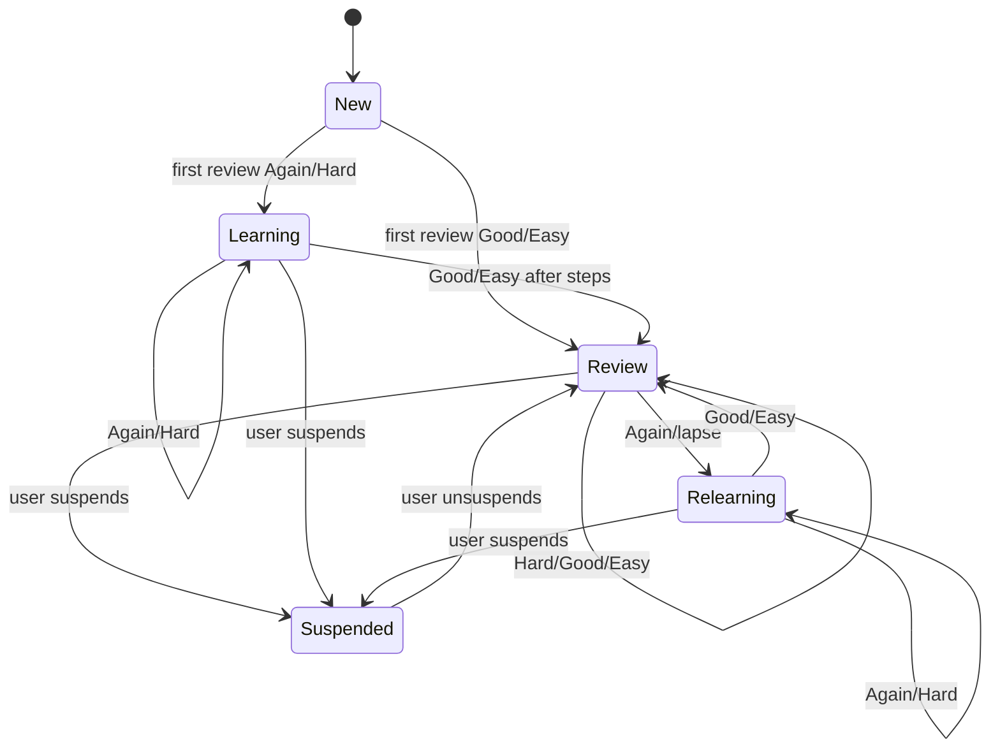

# SRS and Practice Design

Status: product/practice design deliverable. Planning only.

## FSRS model and review state

### Public/OSS scheduling facts

- **[PUBLIC, high]** `ts-fsrs` documents four card states: `New`, `Learning`, `Review`, and `Relearning`, with ratings `Again`, `Hard`, `Good`, and `Easy`.
- **[PUBLIC, high]** `ts-fsrs` supports previewing all possible scheduling outcomes before the learner answers (`repeat`) and applying one selected rating (`next`).
- **[PUBLIC, high]** FSRS-style state transitions are: new cards enter learning on `Again`/`Hard`/`Good` and may skip to review on `Easy`; review cards remain review on `Hard`/`Good`/`Easy` and move to relearning on `Again`; learning/relearning cards advance or reset through configured short steps.
- **[PUBLIC, high]** Anki can export notes as tab-separated plain text and packaged decks as `.apkg`; packaged deck export can optionally include media and scheduling information.
- **[PUBLIC, high]** Universal Dependencies represents morphology with lemma, a universal POS tag, and feature key/value pairs; UPOS has a fixed universal inventory, while features can include universal and documented language-specific features.

## Review-state model

### Card types

| Card type | Prompt | Answer/reveal | Source anchor | MVP |
|---|---|---|---|---:|
| `recognition` | Show target word/phrase/sentence in cue context. | Meaning, lemma/POS, native cue, notes. | `saved_occurrence` | Yes |
| `production` | Show meaning/native cue/context. | Target word/phrase. | `saved_occurrence` | V1 |
| `clip_to_word` | Play cue audio/video clip. | Pick/recall saved word. | `saved_occurrence` + cache clip | V1 |
| `sentence_order` | Scrambled tokens/phrases from cue. | Reconstructed sentence. | sentence saved occurrence | V1/V2 |
| `shadowing` | Loop cue audio/video. | Optional local ASR/timing comparison. | cue/media range | V2 |

### Review state machine

The concrete state transitions and next due dates should be delegated to FSRS library logic, but Lingotorte owns:

- event append semantics;
- current-state projection;
- card suspension/deletion policy;
- response-time capture;
- practice modes that do or do not affect FSRS scheduling.

## Local equivalents of Lingopie-like practice modes

| Reference mode | Local Lingotorte equivalent | Scheduling effect | Acceptance gate |
|---|---|---|---|
| Flip & Learn | Reveal/rate FSRS card backed by saved occurrence | Updates FSRS through Again/Hard/Good/Easy | Append-only review event and deterministic next due. |
| Match Your Words | Context/clip/audio-to-word matching from saved items | Optional; explicit if it updates FSRS | Local distractors and source cue replay. |
| Perfect Your Vocab | Meaning/translation quiz from saved items | Optional FSRS update only when configured | No online distractor generation by default. |
| Build the Sentence | Reconstruct target cue from tokens/phrases | Practice attempt; optional card type later | Handles punctuation/spacing and links to source cue. |
| Pronunciation/shadowing | Loop cue, record locally, compare locally | Optional V2 practice telemetry | Microphone consent and temp deletion verified. |

## Card generation from video-backed occurrences

- Generate cards from `saved_item` + selected `saved_occurrence`, not detached dictionary entries.
- Card prompt/reveal can include target text, native aligned cue, meaning, notes, lemma/POS/morph, and replayable cue context.
- Card types: recognition, production, clip-to-word, sentence-order, shadowing.
- Cards should remain valid if media is missing by showing text context and relink/open-source warning.

## Grading, scheduling, lapse/relearning behavior

- Use FSRS library after verification for state transitions and due dates.
- Ratings are Again, Hard, Good, Easy.
- FSRS states are New, Learning, Review, Relearning; UI buckets such as Learning/Due/Mastered are projections.
- `review_event` records previous/next state snapshots and response metadata; `review_card_state` is recomputable.
- Lapses move review cards into relearning according to verified FSRS behavior.

## UX flow

1. User saves a word/phrase/sentence from media context.
2. Lingotorte creates or offers a review card anchored to the saved occurrence.
3. Due queue shows cards by local time and UI bucket.
4. Review prompt shows video/text context and reveal/answer affordance.
5. User grades; app appends `review_event` and updates materialized card state.
6. Practice modes create `practice_attempt`; they update FSRS only when explicitly designed to do so.

## Acceptance tests

## Feature acceptance checklist

| Feature | Given | When | Then |
|---|---|---|---|
| Media import | Owned local video fixture | User imports media | App stores path/fingerprint/duration; no media copy unless configured. |
| Subtitle import | Target/native subtitle fixtures | User selects tracks | Cues are parsed with ids/start/end/text/language/role. |
| Cue alignment | Target/native cues with overlapping times | Alignment runs | Target cues link to best native cue or explicit no-match/ambiguous state. |
| Player playback | Imported media | User plays/seeks | Video time updates transcript/caption state. |
| Dual subtitles | Current cue has target/native pair | Video reaches cue time | Target and native lines render; missing native degrades gracefully. |
| Transcript click | Transcript row visible | User clicks row | Video seeks to cue start and row becomes current. |
| Cue loop | Current cue selected | Loop enabled | Playback repeats within cue boundaries until disabled. |
| Speed control | Video loaded | User changes rate | Rate applies and captions/transcript remain synchronized. |
| Token lookup | Tokenized cue | User clicks token | Lookup panel shows local token/lemma/POS/dictionary data or unavailable state. |
| Phrase selection | Cue token range | User selects phrase | Phrase lookup/save action preserves token ids and text span. |
| Sentence explanation | Cue selected | User requests explanation | Local/default-off adapter returns explanation or explicit disabled/unavailable state. |
| Save vocab | Token lookup result | User saves item | Saved item links to media, cue, token occurrence, meaning/notes, created time. |
| Save phrase | Phrase selected | User saves phrase | Saved phrase has occurrence range and source cue/time. |
| Save sentence | Cue selected | User saves sentence | Saved sentence replays/source-links exact cue. |
| My Vocab/Sentences | Saved items exist | User opens library | Items are searchable/filterable and show source context. |
| Review card | Saved item exists | Card generated | Card has saved item id, type, due state, FSRS fields. |
| Review event | Card due | User rates Again/Hard/Good/Easy | Append-only event exists and next due/state changes through FSRS. |
| Flip & Learn | Due card | User reveals/rates | Prompt/reveal/rating sequence updates card. |
| Meaning quiz | Saved items with meanings | Quiz starts | Distractors are local; grading is deterministic. |
| Match Your Words | Saved item with source clip/context | User answers | Correctness maps to saved item; no online calls. |
| Build the Sentence | Saved sentence/tokenized cue | User orders tokens | Scoring handles punctuation/spacing and links back to source cue. |
| Anki export | Saved cards | User exports | Export artifact warns about privacy; no AnkiConnect mutation by default. |
| Backup | Local DB state | User creates/restores backup | Roundtrip preserves media refs, saved items, reviews; media copy is opt-in. |
| Online provider disabled | Any adapter feature | Feature executes | Test observes zero HTTP/network calls. |
| Logging | Error or adapter failure | Logs are written | Logs contain ids/status/error code, not raw cue text/media path/voice payload by default. |
